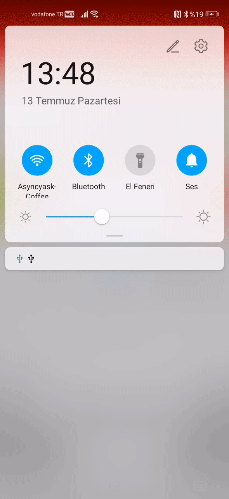
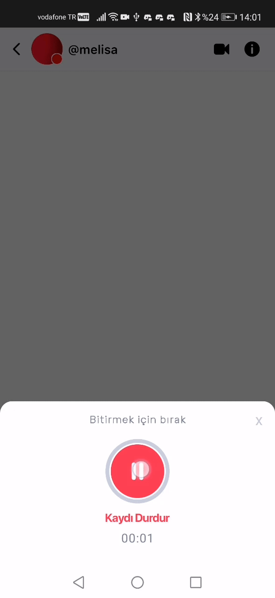
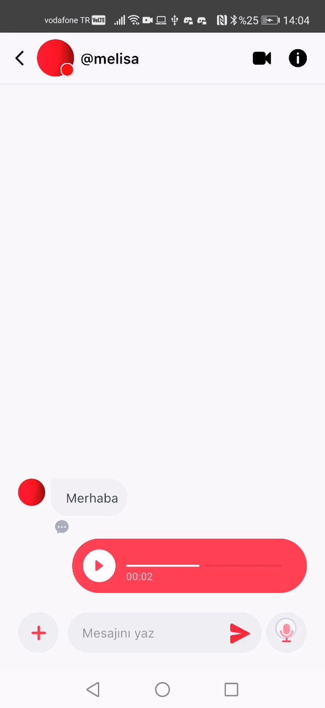
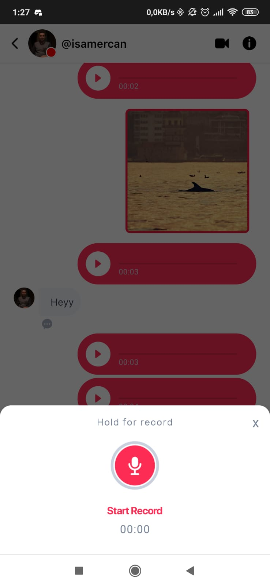
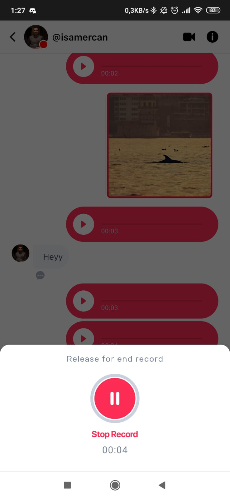
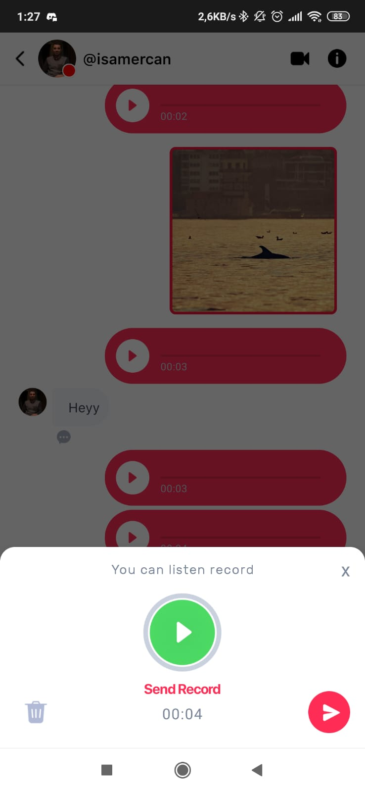
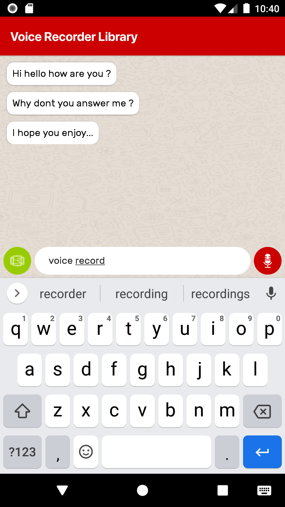
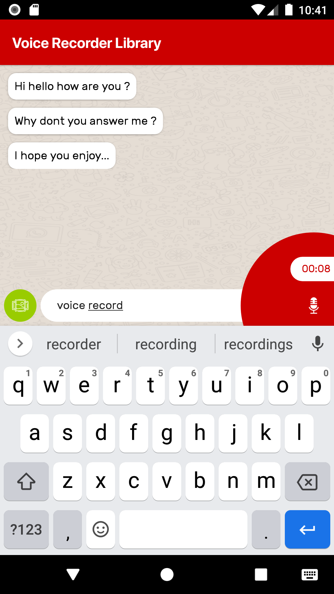
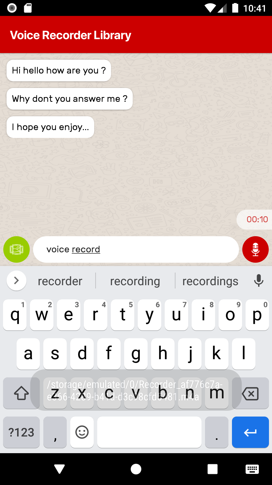

# Easy Audio Recorder

[](https://opensource.org/licenses/Apache-2.0) 


   


> Two stylish design and
> Easy to use record functions

## Why this project exists

> In applications that include chat, it is often desired to record audio in **m4a-mpeg** format to be compatible with **IOS**. To avoid the confusion of algorithms on the chat screen you can use this library to add voice recording feature to your application with a few lines.

## Features and Usage


### Administration Base and Idea

> Start record when press the button and keep recording until release the button.

```kotlin

class DemoActivity : AppCompatActivity(), AudioRecordListener {

private var recorder: Recorder? = null

override fun onCreate(savedInstanceState: Bundle?) {
      super.onCreate(savedInstanceState)
      setContentView(R.layout.activity_button_usage)
      recorder = Recorder(this)
}

override fun onTouch(p0: View?, p1: MotionEvent?): Boolean 
{
      when (p1?.action) {
          MotionEvent.ACTION_DOWN -> {     
              recorder?.startRecord()                    
              return true
          }
          MotionEvent.ACTION_UP,
          MotionEvent.ACTION_BUTTON_RELEASE -> {         
              recorder?.stopRecording()                
              return true
          }
      }
      return false
}

}
```


   


### BottomSheetFragment Usage
[**here  :)**](https://github.com/AsynctaskCoffee/VoiceRecorder/blob/master/app/src/main/java/com/asynctaskcoffee/voicerecorder/BottomSheetUsageActivity.kt)
```kotlin
class BottomSheetUsageActivity : AppCompatActivity(), AudioRecordListener {

    override fun onCreate(savedInstanceState: Bundle?) {
        super.onCreate(savedInstanceState)
        setContentView(R.layout.activity_bottom_sheet_usage)
    }
    
    fun openDialog(view: View) {
        VoiceSenderDialog(this).show(supportFragmentManager, "VOICE")
    }

    override fun onAudioReady(audioUri: String?) {
        TODO("Not yet implemented")
    }

    override fun onRecordFailed(errorMessage: String?) {
        TODO("Not yet implemented")
    }
}
```

### Normal Usage
[**here  :)**](https://github.com/AsynctaskCoffee/VoiceRecorder/blob/master/app/src/main/java/com/asynctaskcoffee/voicerecorder/WorkerUsageActivity.kt)
```kotlin
class WorkerUsageActivity : AppCompatActivity(), AudioRecordListener {

    lateinit var recorder: Recorder

    override fun onCreate(savedInstanceState: Bundle?) {
        super.onCreate(savedInstanceState)
        setContentView(R.layout.activity_worker_usage)
    }

    fun initRecorder() {
        recorder = Recorder(this)
    }

    fun startRecord() {
        recorder.startRecord()
    }

    fun stopRecord() {
        recorder.stopRecording()
    }

    override fun onAudioReady(audioUri: String?) {
        TODO("Not yet implemented")
    }

    override fun onRecordFailed(errorMessage: String?) {
        TODO("Not yet implemented")
    }

}
```

   

### Stylish Button Usage
[**here  :)**](https://github.com/AsynctaskCoffee/VoiceRecorder/blob/master/app/src/main/java/com/asynctaskcoffee/voicerecorder/ButtonUsageActivity.kt)
```kotlin
class ButtonUsageActivity : AppCompatActivity(), AudioRecordListener {

    private var permissionsRequired = arrayOf(
        Manifest.permission.RECORD_AUDIO,
        Manifest.permission.WRITE_EXTERNAL_STORAGE,
        Manifest.permission.READ_EXTERNAL_STORAGE
    )

    private var permissionToRecordAccepted = false
    private var permissionCode = 200

    override fun onCreate(savedInstanceState: Bundle?) {
        super.onCreate(savedInstanceState)
        setContentView(R.layout.activity_button_usage)
        setViews()
    }

    private fun setViews() {
        recordButton.audioRecordListener = this
        if (letsCheckPermissions()) {
            recordButton.setRecordListener()
        } else {
            ActivityCompat.requestPermissions(this, permissionsRequired, permissionCode)
        }
    }

    override fun onAudioReady(audioUri: String?) {
        Toast.makeText(this, audioUri, Toast.LENGTH_SHORT).show()
    }

    override fun onRecordFailed(errorMessage: String?) {
        Toast.makeText(this, errorMessage, Toast.LENGTH_SHORT).show()
    }

    private fun letsCheckPermissions(): Boolean {
        return ContextCompat.checkSelfPermission(
            this,
            android.Manifest.permission.RECORD_AUDIO
        ) == PackageManager.PERMISSION_GRANTED && ContextCompat.checkSelfPermission(
            this,
            android.Manifest.permission.WRITE_EXTERNAL_STORAGE
        ) == PackageManager.PERMISSION_GRANTED && ContextCompat.checkSelfPermission(
            this,
            android.Manifest.permission.READ_EXTERNAL_STORAGE
        ) == PackageManager.PERMISSION_GRANTED
    }

    override fun onRequestPermissionsResult(
        requestCode: Int,
        permissions: Array<out String>,
        grantResults: IntArray
    ) {
        super.onRequestPermissionsResult(requestCode, permissions, grantResults)
        if (requestCode == permissionCode) {
            permissionToRecordAccepted =
                (grantResults[0] == PackageManager.PERMISSION_GRANTED) && ((grantResults[1] == PackageManager.PERMISSION_GRANTED))
            if (permissionToRecordAccepted) recordButton.setRecordListener()
        }
        if (!permissionToRecordAccepted) Toast.makeText(
            this,
            "You have to accept permissions to send voice",
            Toast.LENGTH_SHORT
        ).show()
    }

}
```

```xml
<?xml version="1.0" encoding="utf-8"?>
<FrameLayout xmlns:android="http://schemas.android.com/apk/res/android"
    xmlns:app="http://schemas.android.com/apk/res-auto"
    xmlns:tools="http://schemas.android.com/tools"
    android:layout_width="match_parent"
    android:layout_height="match_parent"
    tools:context=".ButtonUsageActivity">

    <ImageView
        android:layout_width="40dp"
        android:layout_height="40dp"
        android:layout_gravity="bottom"
        android:layout_margin="5dp"
        android:background="@drawable/button_circle"
        android:backgroundTint="@android:color/holo_green_light"
        android:padding="10dp"
        android:src="@drawable/ic_gallery_icon"
        android:tint="@color/white" />


    <androidx.cardview.widget.CardView
        android:layout_width="match_parent"
        android:layout_height="40dp"
        android:layout_gravity="bottom"
        android:layout_marginStart="50dp"
        android:layout_marginEnd="50dp"
        android:layout_marginBottom="5dp"
        app:cardBackgroundColor="@color/white"
        app:cardCornerRadius="20dp"
        app:cardElevation="0dp">

        <EditText
            android:layout_width="match_parent"
            android:layout_height="match_parent"
            android:background="@null"
            android:fontFamily="@font/rubik_regular"
            android:hint="Your Message"
            android:paddingStart="20dp"
            android:paddingEnd="15dp"
            android:textSize="14sp" />

    </androidx.cardview.widget.CardView>

    <com.asynctaskcoffee.audiorecorder.uikit.RecordButton
        android:id="@+id/recordButton"
        android:layout_width="match_parent"
        android:layout_height="match_parent"
        android:layout_gravity="bottom|end" />

</FrameLayout>
```

```xml
<manifest xmlns:android="http://schemas.android.com/apk/res/android"
    xmlns:tools="http://schemas.android.com/tools">

    <uses-permission android:name="android.permission.RECORD_AUDIO" />
    <uses-permission android:name="android.permission.WRITE_EXTERNAL_STORAGE" />
    <uses-permission android:name="android.permission.READ_EXTERNAL_STORAGE" />

    <application
        android:requestLegacyExternalStorage="true"
        tools:targetApi="q" />
</manifest>
```

### Extras

##### Change Record Path

```kotlin
fun setFileName(fileName: String?) {
   this.fileName = fileName
}
```

##### Beep before record

```kotlin
val dialog = VoiceSenderDialog(this)
dialog.setBeepEnabled(true)
dialog.show(supportFragmentManager, "VOICE")
```

```kotlin
recordButton.audioRecordListener = this
recordButton.beepEnabled = true
```

##### Easy MPlayer

```kotlin
lateinit var player: Player

override fun onAudioReady(audioUri: String?) {
    player = Player(this)
    player.injectMedia(audioUri)
}

fun playRecord(view: View) {
    if (player.player!!.isPlaying)
        player.stopPlaying()
    else player.startPlaying()
}
```

##### Customize Dialog Language with LangObj

```java
public LangObj() {
}

String record_audio_string = "Start Record";
String hold_for_record_string = "Hold for record";
String release_for_end_string = "Release for end record";
String listen_record_string = "You can listen record";
String stop_listen_record_string = "Stop Listen";
String stop_record_string = "Stop Record";
String send_record_string = "Send Record";

public LangObj(String record_audio_string, String hold_for_record_string, String release_for_end_string, String listen_record_string, String stop_listen_record_string, String stop_record_string, String send_record_string) {
    this.record_audio_string = record_audio_string;
    this.hold_for_record_string = hold_for_record_string;
    this.release_for_end_string = release_for_end_string;
    this.listen_record_string = listen_record_string;
    this.stop_listen_record_string = stop_listen_record_string;
    this.stop_record_string = stop_record_string;
    this.send_record_string = send_record_string;
}
```

```java
public VoiceSenderDialog(AudioRecordListener audioRecordListener, LangObj langObj) {
    this.langObj = langObj;
    this.audioRecordListener = audioRecordListener;
}
```

##### Customize Dialog Icons with LangObj

```java
public IconsObj() {
}

int ic_start_record = R.drawable.ic_start_record;
int ic_stop_play = R.drawable.ic_stop_play;
int ic_play_record = R.drawable.ic_play_record;
int ic_audio_delete = R.drawable.ic_audio_delete;
int ic_send_circle = R.drawable.ic_send_circle;
int ic_stop_record = R.drawable.ic_stop_record;

public IconsObj(int ic_start_record, int ic_stop_play, int ic_play_record, int ic_audio_delete, int ic_send_circle, int ic_stop_record) {
    this.ic_start_record = ic_start_record;
    this.ic_stop_play = ic_stop_play;
    this.ic_play_record = ic_play_record;
    this.ic_audio_delete = ic_audio_delete;
    this.ic_send_circle = ic_send_circle;
    this.ic_stop_record = ic_stop_record;
}
```

```java
public VoiceSenderDialog(AudioRecordListener audioRecordListener, IconsObj iconsObj) {
    this.iconsObj = iconsObj;
    this.audioRecordListener = audioRecordListener;
}
```


## Implementation Gradle

###### Add it in your root build.gradle at the end of repositories

```groovy
allprojects {
    repositories {
        maven { url 'https://jitpack.io' }
    }
}
```

###### Add the dependency

```groovy
dependencies {
    implementation 'com.github.AsynctaskCoffee:VoiceRecorder:beta-0.5'
}
```

## Implementation Maven

###### Add the JitPack repository to your build file

```xml
<repositories>
	<repository>
		<id>jitpack.io</id>
		<url>https://jitpack.io</url>
	</repository>
</repositories>
```

###### Add the dependency

```xml
<dependency>
	<groupId>com.github.AsynctaskCoffee</groupId>
	<artifactId>VoiceRecorder</artifactId>
	<version>beta-0.5</version>
</dependency>
```


## Credits

@vedraj360


## License

```
Copyright 2020 Egemen ÖZOGUL

Licensed under the Apache License, Version 2.0 (the "License");
you may not use this file except in compliance with the License.
You may obtain a copy of the License at

    http://www.apache.org/licenses/LICENSE-2.0

Unless required by applicable law or agreed to in writing, software
distributed under the License is distributed on an "AS IS" BASIS,
WITHOUT WARRANTIES OR CONDITIONS OF ANY KIND, either express or implied.
See the License for the specific language governing permissions and
limitations under the License.
```
